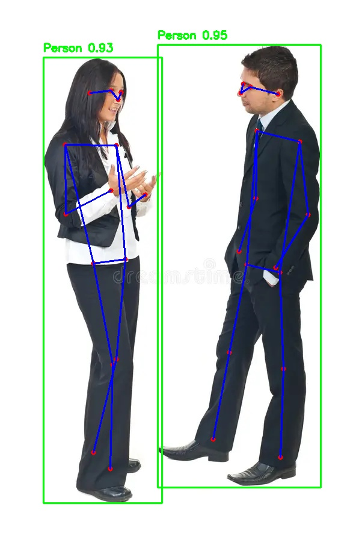

Absolutely ✅ — here’s a **clean, single-page `README.md`** for your **Human Pose Estimation** project (perfect for GitHub):

---

````markdown
# 🧍 Human Pose Estimation using YOLO

This project uses **Ultralytics YOLO** models for real-time **human detection and pose estimation** in videos. It detects people, estimates body keypoints, and saves an annotated output video.

---

## ⚙️ Setup

### 1️⃣ Clone and install dependencies
```bash
git clone <your_repo_url>
cd "Human Pose Estimation"
pip install -r requirements.txt
````

If you don’t have one yet, generate it with:

```bash
pip freeze > requirements.txt
```

---

## 🧠 Configuration

Edit paths and parameters in **`config.py`**:

```python
DET_MODEL_PATH = "/path/to/yolo11x.pt"
POSE_MODEL_PATH = "/path/to/yolo11x-pose.pt"
VIDEO_PATH = "/path/to/input.mp4"
SAVE_PATH2 = "outputs/pose_output.mp4"
CONF_THRESHOLD = 0.5
IOU_THRESHOLD = 0.4
DEVICE = "mps"  # or "cpu" / "cuda"
```

---

## ▶️ Run

```bash
python main.py
```

* Press **`q`** to exit the live preview.
* Output video will be saved to **`outputs/pose_output.mp4`**.

---

## 📦 Folder Structure

```
Human Pose Estimation/
├── main.py
├── config.py
├── pose_utils.py
├── outputs/
├── dataset/
└── README.md
```

---

## 🧩 Dependencies

```
ultralytics
opencv-python
numpy
```

---

## 📸 Example Output

Annotated poses with bounding boxes and keypoints:



---

## 👤 Author

**Kunal Kumar Singh**
AI Engineer | Machine Learning Developer
📧 [ks286823@gmail.com](mailto:ks286823@gmail.com)

```

---

This version is concise (GitHub-friendly), easy to read in one scroll, and ready to drop in your repo root as `README.md`.  

Would you like me to include a short “How It Works” section (like model flow: detect → estimate pose → draw)?
```
